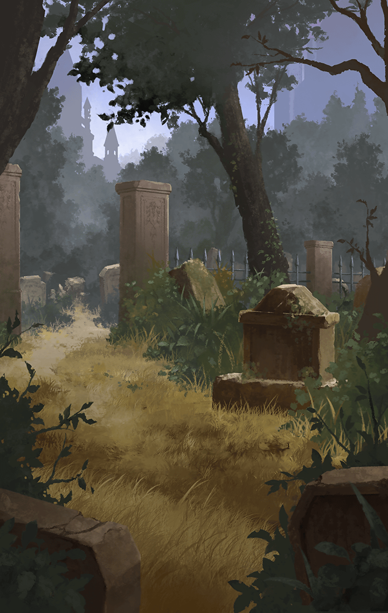

**【ティルフィング】**
国王陛下は、
祭壇にいる…

**【ティルフィング】**
あの人達は、
そう言っていたわね

**【デュリン】**
うん
…大天使と
対面しているのかしら？

**【リベリオン】**
その可能性が高いな
お前達は、
先に祭壇に向かえ

**【リベリオン】**
…決して無理は
するなよ

**【トト】**
え…？

**【トト】**
おじさん、
一人でフレンネル大公を
助けに行くの…？

**【リベリオン】**
フレンネルの子孫と
話しておきたいからな…

**【リベリオン】**
大公の解放には
俺が行く

**【ティルフィング】**
確かに…
ぞろぞろとみんなで行く必要は
ないかもしれませんね

**【リベリオン】**
ああ

**【リベリオン】**
むしろ、気まぐれな神々を
引き止めておいてくれた方が
ありがたい

**【リベリオン】**
…ボウズ、
お前はどうする？

**【リベリオン】**
フレンネル大公に
会いに行くか？

**【トト】**
…僕は
…ディーンとの約束が
あるから

**【リベリオン】**
あ？

**【トト】**
黒奏官を倒せって、
ディーンに託されたんだ

**【トト】**
フレンネル大公に会うのは、
その約束を果たしてからにするよ

**【リベリオン】**
…クク
…いっぱしのことを
言うじゃねぇか…

**【リベリオン】**
事が済み次第、
俺も合流する…

**【リベリオン】**
この身が、
消えていなければの話だが

**【ティルフィング】**
わかりました…
リベリオンさんも、
無理はなさらないで下さい

**【ティルフィング】**
…行きましょう！

**【王立軍兵士Ａ】**
く、来るぞーっ！！
…ぐぁっ！！！

**【リベリオン】**
ここか…
…悪いが、邪魔するぜ

**【リベリオン】**
怪我したくなけりゃ、
さっさと逃げな

**【王立軍兵士Ｂ】**
ヒ、ヒィッ…！

**【リベリオン】**
お、おい、待て！
カギをよこしてから…

**【リベリオン】**
ったく…

**【リベリオン】**
…そこか
…面倒だ、
鉄格子をぶった斬るぞ

**【？？？】**
…その剣は、
魔剣レーヴァテイン

**【？？？】**
…リベリオン殿で
あられるか？

**【リベリオン】**
アンタが、
フレンネル大公…

**【リベリオン】**
俺が出会った
フレンネルの子孫だな？

**【フレンネル】**
いかにも…
…アナタの到来を、
ずいぶんと待ち侘びましたぞ？

**【リベリオン】**
ちょっとばかり、
道が混んでてな

**【リベリオン】**
…悪い
…どうやら教皇は、
始末されちまったようだ

**【フレンネル】**
そうか…

**【フレンネル】**
いや、アナタが謝ることではない…
あの男を信頼し過ぎた、
私が浅はかだったのだ

**【フレンネル】**
思うような成果を出せなかったのも、
すべては我が一族の力不足に
他ならん

**【フレンネル】**
…申し開きのしようもない

**【リベリオン】**
なに…
思い通りに時が流れるわけじゃない、
仕方ねぇさ

**【リベリオン】**
それに、
問題点は見えた…

**【リベリオン】**
もし、
やり直すことが可能になれば、
解決できるはずだ

**【フレンネル】**
やり直す…？
…時を遡るということか？

**【リベリオン】**
まだ、
そこまでの技術はないがな

**【リベリオン】**
だが、
近い将来…
実現できる可能性はある

**【フレンネル】**
なるほど…
そういうことか…

**【リベリオン】**
あ…？

**【フレンネル】**
いや…

**【フレンネル】**
伝え聞いている通り、
すさまじい世界だな…
アナタ方の世界は

**【リベリオン】**
少しばかり、
技術が進歩してるだけだ

**【リベリオン】**
俺達が置かれている状況は、
この世界の人間達と
大して変わりねぇよ

**【リベリオン】**
…この銃を持っていけ
ノーブルって教授先生が、
王都広場でお前を待ってる

**【フレンネル】**
…アナタは？

**【リベリオン】**
ここまで騒ぎを大きくしちまったら…
一番のお偉いさんに、
挨拶しないわけにはいかねぇだろ？

**【フレンネル】**
！！

**【フレンネル】**
…穏便に済ませたかったが、
そうもいかんか…

**【フレンネル】**
やれやれ…
忙しくなりそうだ

**【リベリオン】**
この世界の行く末は、
お前が担ってるってことだ

**【リベリオン】**
安心しろ、
できうる限り
話はつけてやる…

**【リベリオン】**
…たとえ、
この命が消え果てようとな

**【フレンネル】**
…フッ
…水を差すようだが、
その覚悟は無用だな

**【リベリオン】**
あ…？

**【フレンネル】**
…その窓から、
墓地が見えますかな？

**【リベリオン】**
…ああ

**【リベリオン】**
…ここに牢をしつらえたのは、
投獄された者に墓場に
近付いていることを悟らせる為か？

**【リベリオン】**
まったく、
いい趣味だな

**【フレンネル】**
…その中央に、
ひときわ古い墓が
見えるはずだ

**【リベリオン】**
…ああ
…あれが、
どうかしたのか？

**【フレンネル】**
その古びた墓に刻まれているのは…
リベリオン、
アナタの名前だ

**【リベリオン】**
な…！？

**【フレンネル】**
つまり…
アナタが死ぬのは、
この時代ではないということ

**【フレンネル】**
はるか遠く…
大昔の時代に遡った先で、
アナタは尽き果てるのだよ

**【リベリオン】**
！！
そうか…
そういうことか…

**【フレンネル】**
…アナタにとって、
悪い知らせだったかな…？

**【リベリオン】**
…いや
…クク…
まったく、こき使ってくれるぜ…

**【リベリオン】**
吉報をありがとよ

**【リベリオン】**
…頼んだぜ、
フレンネル
…この世界の行く末を

**【フレンネル】**
それは、
こちらのセリフですな

**【フレンネル】**
…頼みましたぞ、
リベリオン殿

**【フレンネル】**
…この世界の
…希望の種を

**【リベリオン】**
フッ…

**【フレンネル】**
さて…
私も行くとしようか…

**【フレンネル】**
…人類の未来を占う、
闘いの地へ！！

**【王政府上層部２】**
ハァ…ハァ…
ヤツらは…？

**【王政府上層部３】**
いや…
まだ辿り着いては
おらぬようですな

**【王政府上層部２】**
よし！
この緊急事態だ、
やむを得ん…

**【王政府上層部２】**
国王に
塩梅を聞こうではないか

**【？？？】**
…いかがなされた、
そのように血相を変えられて

**【王政府上層部２・３】**
…？

**【黒奏官】**
ただいま国王陛下は、
大天使様と謁見中…

**【黒奏官】**
そこに分け入ることは許されぬと、
ご承知のはずですが？

**【王政府上層部３】**
こ、黒奏官！

**【王政府上層部２】**
貴様…
ここにおったのか…！？

**【黒奏官】**
騒ぎは、
謁見の妨げとなる…
わきまえられよ

**【王政府上層部２】**
クッ…
なにをぬけぬけと！！

**【王政府上層部３】**
…リベリオンが
元老院にまで到達した

**【王政府上層部３】**
もはや、
ここに至るのも
時間の問題…

**【王政府上層部３】**
それをお伝えすべく、
参じたのだ

**【黒奏官】**
ほう…
元老院にまで…

**【王政府上層部２】**
いったい、
どうなっておる！

**【王政府上層部２】**
神々から、
お言葉は
賜われたのか！？

**【黒奏官】**
ふむ…
祭壇の様子が
気になると？

**【黒奏官】**
ならば、
お入りになられるか？

**【王政府上層部２】**
！！
無論だ！

**【王政府上層部２】**
早く、
我らも中へ！！

**【黒奏官】**
そう、
慌てなさるな

**【黒奏官】**
では…

**【王政府上層部２】**
う…
…あれは…！？

**【王政府上層部３】**
だ、大天使様！！！

**【王政府上層部２】**
…！？
あれに倒れ伏すは…
国王か…！？

**【王政府上層部３】**
なんだ…！？
なにがどうなっている…！？

**【黒奏官】**
クク…

**【黒奏官】**
…ほう
…なかなかに、
早い到着だな

**【トト】**
うわっ…
眩しい！

**【ティルフィング】**
クッ…
ここが、祭壇…？

**【デュリン】**
…！？
あれは…！？

**【王政府上層部１】**
な、なぜだ…！？
なぜ、国王を亡き者に…！？

**【？？？】**
『…この世界を託すだけの器量が、
　この者には
　不足していたということです』

**【？？？】**
『…参謀として仕える、
　そなたらにも…』

**【王政府上層部１】**
お…おおっ…
お、お待ちを！
…うぐ…あああぁぁぁ…ぁぁ…！！！

**【デュリン】**
！！！
消された…！？

**【デュリン】**
こ、国王も…
消されたってこと…！？

**【ティルフィング】**
クッ…

**【黒奏官】**
待て…
部外者が、
邪魔立てするな

**【ティルフィング】**
邪魔って…

**【黒奏官】**
これは、
神々より与えられし罰…

**【黒奏官】**
権威にあぐらをかき、
起こりうる災厄への対処を怠った者に
与えられし天罰だ

**【ティルフィング】**
そんなっ…

**【王政府上層部２・３】**
…う
…ハァァァっ！！！

**【黒奏官】**
…まったく、
見苦しい

**【黒奏官】**
ラファエル様の手を
煩わせるまでも
あるまい…

**【黒奏官】**
…グリード

**【王政府上層部２・３】**
ガッ！！！！

**【ティルフィング】**
！！！

**【王政府上層部２】**
ワ…ワシらは、所詮…
捨て駒だというの…か…
…ガハッ！！！

**【ティルフィング】**
な、なんてことをっ…

**【デュリン】**
あ、あれが…
大天使…
ラファエル…！！

**【ラファエル】**
『“神魔契約”に背きし、
　世界をまたぐ者の姿が
　見えませんが…』

**【黒奏官】**
ご安心ください…
間もなく訪れましょう

**【デュリン】**
だ、大天使！
本当に実在したのね…！？

**【ティルフィング】**
…これが…神々の正義だというの…？

**【黒奏官】**
…なに？

**【ティルフィング】**
こんな仕打ちが…
世の正義であるはずがない…！

**【黒奏官】**
…グリード

**【ティルフィング】**
クッ…

**【グリード】**
…大天使様の御前で、
粗相が過ぎるわ
自省なさい…！