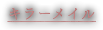
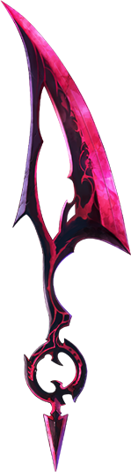

# 地上編

## 人類と武具の名を持つ

### キラーメイル

### 神器

## 荒廃したトウキョウで人々は悪魔に抗う 生き残る可能性が0%でも、希望を見出すために

「プロジェクトZERO」の一環として2016年4月より開始し、2017年6月に完結を迎えたのが地上編。天上編第1章よりも少し前の時代、ラグナ大陸の下に広がる「トウキョウ」と呼ばれる地域を舞台に、世界を支配する七魔王とそれに抗おうとする人間たちとの戦いが描かれる。

中世ヨーロッパを思わせたラグナ大陸とは異なり、トウキョウには近未来のような高層建築物が立ち並んでいる。

しかし、建物はそのほとんどが崩れ落ち、さらに七魔王が打ち立てた6つの「魔壁」によって世界は分断されているのだ。

そんななかで、わずかに生き残った人間たちは「特務機関ラグナロク」を設立し、悪魔に対抗する戦士を生み出した。

魔獣の血を身体に宿した「キラーメイル」と……伝説の神器を身体に宿した「キラープリンセス」を。

# プロジェクト ZERO

## 

## 

## 

### 

### 

### 

### 

### 

## 

## 

## 

