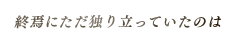
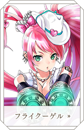
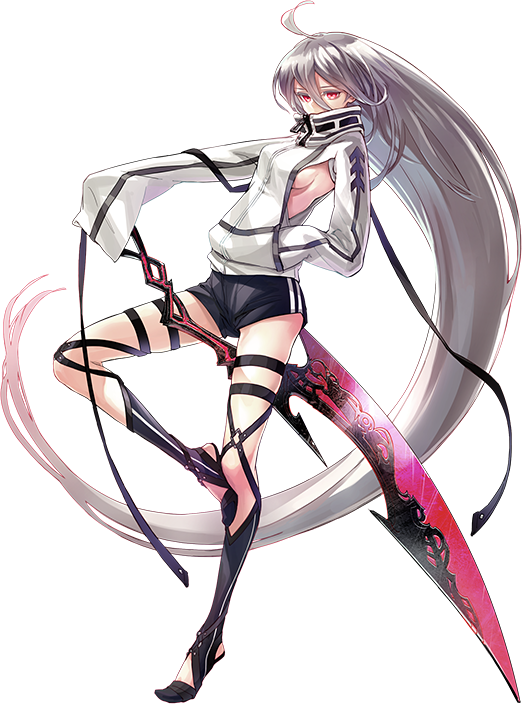

# 天上編

## 世界樹ユグドラシルに連なる

### マスター

### イミテーション

### 淘汰

### キラーズとバイブス

### キラープリンセス(キル姫)

#### 武器

## プロローグ

## 世界樹が見守る世界で紡がれる姫たちの「宿命」と人間たちの「可能性」の物語

2014年10月、『ファントム オブ キル』のアプリ配信とともに幕を開けたのが、この天上編だ。

ストーリーの舞台となるのは、世界樹ユグドラシルを中心に、中世ヨーロッパを彷彿とさせる城塞や田園風景が広がる「ラグナ大陸」。

記憶を失い、この世界の外れで目を覚ました主人公は、ティルフィングと名乗る「キラープリンセス」と出会う。

キラープリンセスとは伝説の武器の名前を冠し、卓越した戦闘能力をもつ少女のこと。

彼女たちは、同じ姿かたち・能力を持った存在が無数におり、最後のひとりとなるまで闘い・統合することを宿命づけられているという。

ティルフィングからキラープリンセスの力を引き出す能力「バイブス」の持ち主であると告げられた主人公は、彼女の闘いの手助けをし、そして自らの記憶を取り戻すために長い長い旅に出ることになる。

## Character

## 

## 

## 

## 

## 

## 

## 

## 

## 

## 

