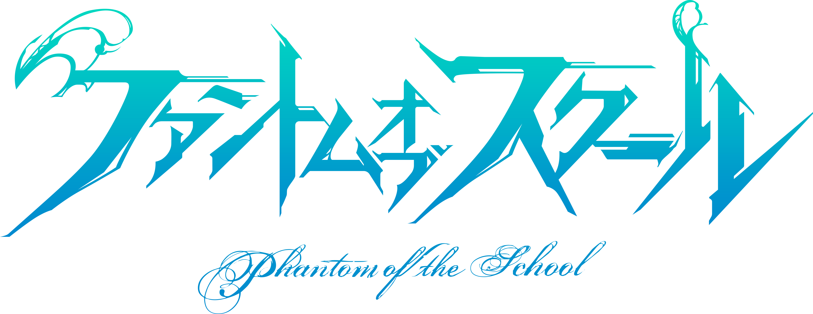

# 学園編

## 制服姿のキル姫たちと描く青春グラフィティ

現代日本を舞台に、女学生の制服に身を包んだキル姫たちとの触れ合いを描くのが、『ファントムオブスクール』(通称・ファンキル学園)。2016年7月に配信がスタートし、2019年10月にいったんの完 結を迎えた。
ファンキル学園には「聖ユグドラシル 姫学院」と「ラグナロク女学院」、そして「牙克城学院」という3つの女子高が登場し、マスターは唯一の男子生徒として三校に編入させられることにな る。三校の共学化に向けたテストケース・・・という表の理由とは別に、負の心が増大した生徒が「異族化」する事件を解決できる存在として、マスターは派遣されたのだ。
